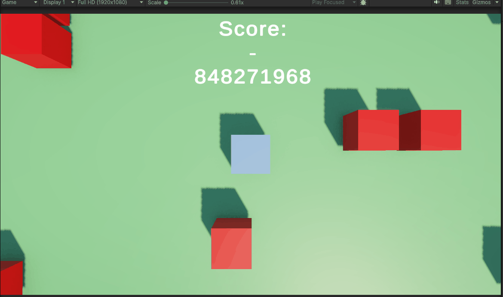

# M5PROGOPD2

# opdracht unity enemy

# scripts zijn hier [scripts](https://github.com/beebopyomi/M5PROG/tree/main/Assets/Scripts)

opdracht is hier [Link naar code](https://github.com/beebopyomi/M5PROG/tree/main/Assets/)

wat is de opdracht? gwn laten zien hoe scripts met elkaar comuniceeren als ze like niet 1 script zijn.
